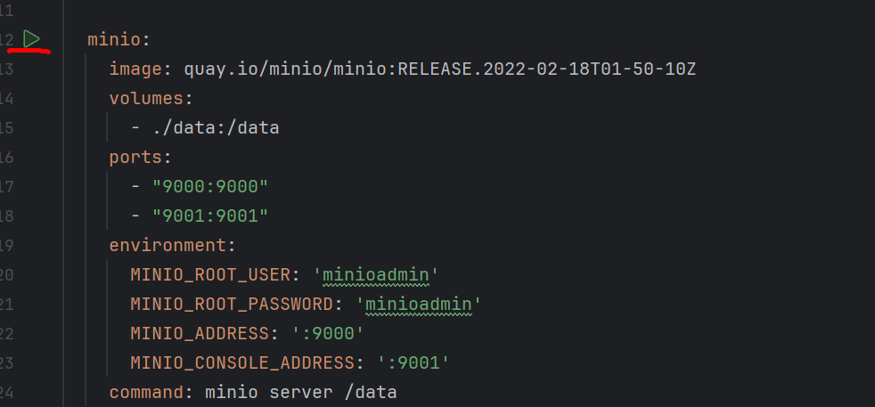

# File Storage Service

Это приложение предоставляет REST API для хранения и управления файлами. Сервис разработан с использованием Spring Boot, PostgreSQL и MinIO, и может быть развернут с использованием Docker и Docker Compose.

## Требования:
- Docker
- Docker Compose

## Запуск проекта:

### 1. Сборка и запуск контейнеров:

1. Перейдите в корневую директорию проекта и выполните команду для сборки Docker-образа:

    ```bash
    docker build -t filestorage-app .
    ```

2. После успешной сборки образа запустите контейнеры с помощью `docker-compose`:

    ```bash
    docker-compose up --build
    ```

### 2. Конфигурация MinIO:

Для хранения файлов используется MinIO — S3-совместимое объектное хранилище. MinIO также запускается в контейнере с помощью `docker-compose`.

1. Запустите это в docker-compose 
2. Откройте браузер и перейдите по адресу [http://localhost:9000](http://localhost:9000).
3. Введите `minioadmin` в качестве имени пользователя и пароля (или измените их в файле `docker-compose.yml`, если требуется).


### 3. Доступ к API:

После того как контейнеры будут запущены, сервис будет доступен по следующему адресу:

[http://localhost:8080/hello](http://localhost:8080/hello)

### 4. Доступ к Swagger UI:

Swagger UI предоставляет возможность взаимодействовать с REST API и просматривать всю доступную документацию. Используйте следующий URL для доступа:

[http://localhost:8080/swagger-ui/index.html](http://localhost:8080/swagger-ui/index.html)

## Остановка проекта:

Чтобы остановить все запущенные контейнеры, используйте команду:

```bash
docker-compose down
